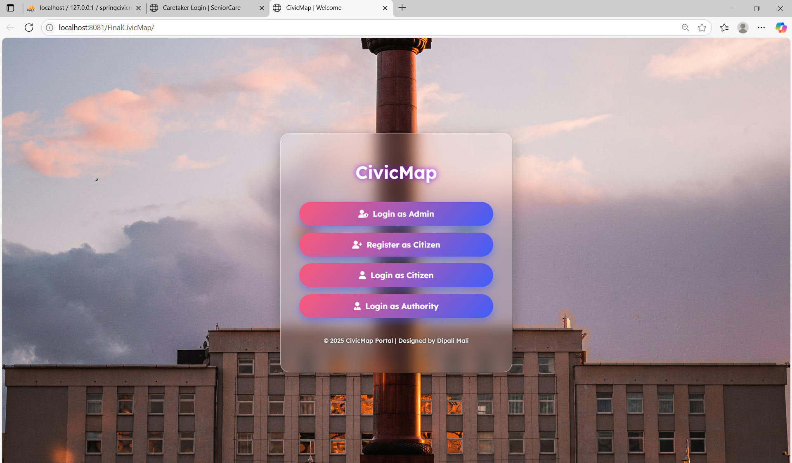
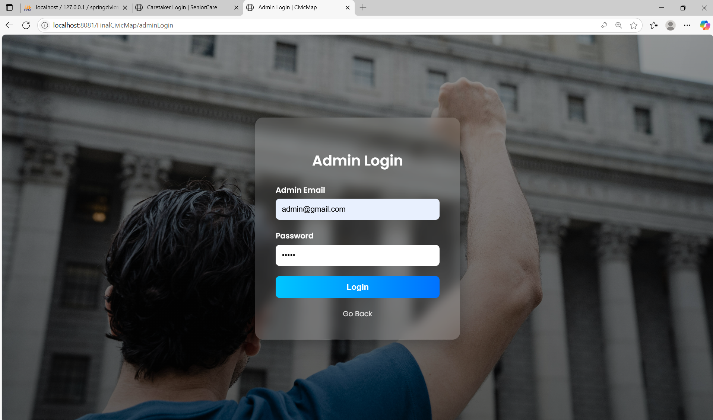
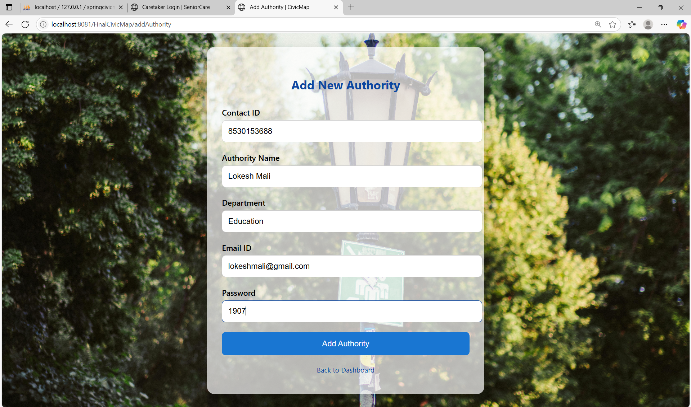
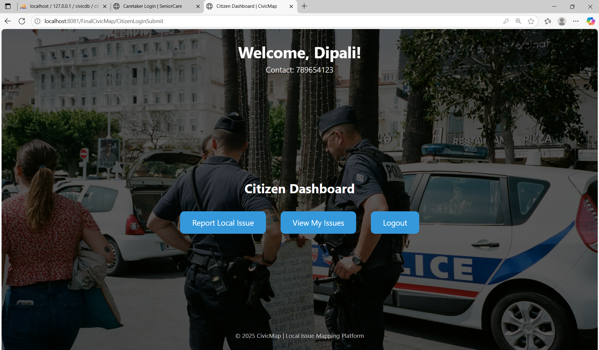
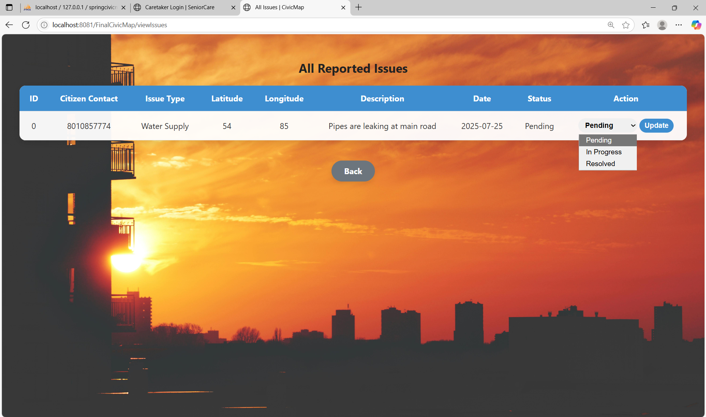

<h1 align="center">🏙️ CivicMap</h1>
<h3 align="center">Spring Boot Based Civic Issue Management Platform</h3>

<p align="center">
Role-Based Issue Reporting & Resolution System for Citizens and Local Authorities
</p>

---

## 🚀 About The Project

CivicMap is a full-stack Spring Boot MVC web application that enables citizens to digitally report local civic issues and allows authorities to manage and resolve them efficiently.

The system follows a structured layered architecture and implements role-based authentication for secure operations.

---

# 🛠️ Tech Stack

<p align="center">


</p>

---

# 🏗️ System Architecture

```
Client (Browser)
        ↓
Spring Boot Controller Layer
        ↓
Service Layer (Business Logic)
        ↓
Repository Layer (Spring Data JPA)
        ↓
MySQL Database
```

### 🔹 Architecture Pattern
- MVC (Model-View-Controller)
- Layered Enterprise Architecture
- Role-Based Access Control

---

# 🗄️ ER Diagram (Conceptual Design)

### Entities

🔹 Citizen  
- contact_id (PK)  
- name  
- email  
- address  
- password  

🔹 Authority  
- contact_id (PK)  
- name  
- department  
- email  
- password  

🔹 Admin  
- email (PK)  
- password  

🔹 Issue  
- issue_id (PK)  
- citizen_contact (FK)  
- issue_type  
- latitude  
- longitude  
- description  
- date  
- status  

### Relationships

- One Citizen ➜ Reports Multiple Issues  
- One Authority ➜ Manages Multiple Issues  
- Admin ➜ Controls Authorities  

---

# 🔐 Core Features

## 👤 Citizen Module
✔ Register  
✔ Login  
✔ Report Issue  
✔ Track Status  

## 🏛 Authority Module
✔ Login  
✔ View Assigned Issues  
✔ Update Issue Status  

## 🛠 Admin Module
✔ Add Authority  
✔ Delete Authority  
✔ View Authorities  
✔ View Citizens  
✔ Monitor All Issues  

---

# 🔄 Issue Workflow

```
Citizen Reports Issue
        ↓
Issue Stored (Pending)
        ↓
Authority Reviews
        ↓
Status Updated
        ↓
Citizen Tracks Resolution
```

---

# 📸 Application Screenshots


### 🏠 Home Page


### 🔐 Admin Login


### 🛠 Admin Dashboard


### ➕ Add Authority


### 🗑 Delete Authority


### 👥 View Authorities


### 👤 Citizen Registration


### 🔐 Citizen Login


### 🏠 Citizen Dashboard


### 📍 Report Issue


### 📊 View All Issues


### 📌 Reported Issue Status


### 🏢 Authority Login


### 🏠 Authority Dashboard


---

# ⚙️ Installation Guide

## 1️⃣ Clone Repository

```bash
git clone https://github.com/your-username/CivicMap-SpringBoot.git
```

---

## 2️⃣ Setup Database

```sql
CREATE DATABASE civicdb;
```

Import:
```
civicdb.sql
```

---

## 3️⃣ Configure application.properties

```properties
spring.datasource.url=jdbc:mysql://localhost:3306/civicdb
spring.datasource.username=root
spring.datasource.password=yourpassword
spring.jpa.hibernate.ddl-auto=update
```

---

## 4️⃣ Run Application

```bash
mvn spring-boot:run
```

Access:
```
http://localhost:8081/
```

---

# 📂 Project Structure

```
CivicMap-SpringBoot
│
├── src/
├── civicdb.sql
├── pom.xml
├── screenshots/
└── README.md
```

---

# 🚀 Future Enhancements

- Spring Security (JWT)
- Google Maps Integration
- Email Notifications
- Admin Analytics Dashboard
- Docker Deployment
- Cloud Hosting

---

# 👩‍💻 Developed By

**Dipali Mali**  
Java | Spring Boot | Full Stack Developer  

---

# ⭐ Support

If you found this project useful, please give it a ⭐ on GitHub!
